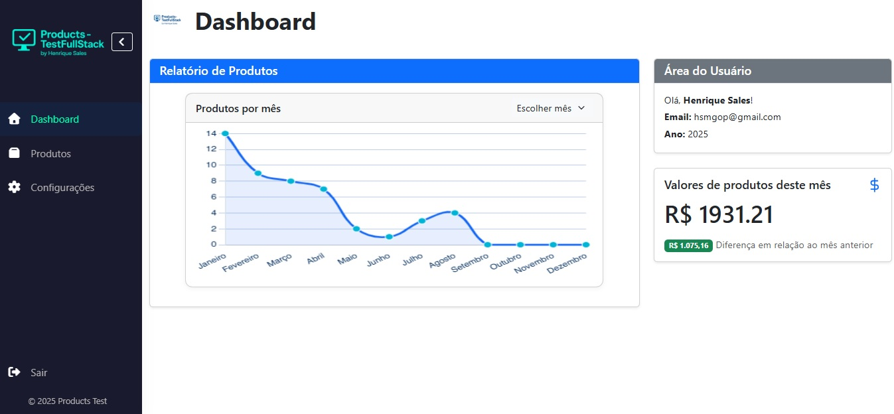
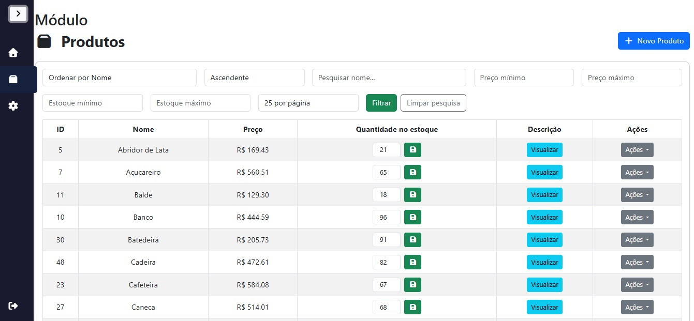
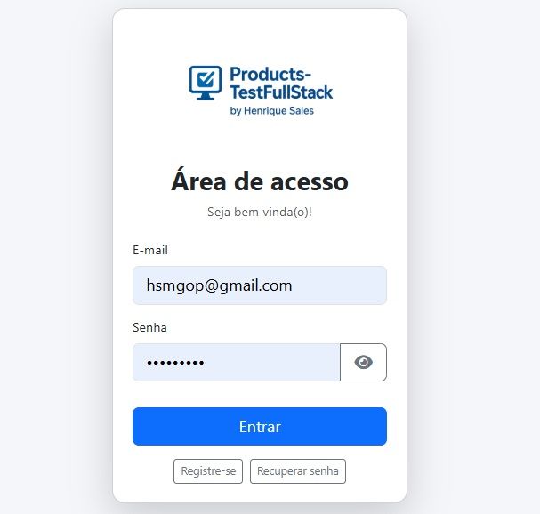

<p align="center"><a href="https://laravel.com" target="_blank"></a></p>

# Test Products - Sistema Fullstack Laravel + Vue + Docker + PostgreSQL

## Repositório
- HTTPS: [https://github.com/henriquesalesmg/products_fullstack.git](https://github.com/henriquesalesmg/products_fullstack.git)
- SSH: `git@github.com:henriquesalesmg/products_fullstack.git`

## Descrição do Projeto
Sistema desenvolvido para o teste técnico, focado em gestão de produtos domésticos. Utiliza Laravel 12 no backend, Vue 3 no frontend (SPA), Docker para ambiente isolado e PostgreSQL como banco de dados. A escolha do stack foi motivada pela vaga pleiteada, que valoriza experiência com Vue e PostgreSQL.

O sistema implementa princípios SOLID, garantindo código limpo, modular e fácil manutenção. Possui autenticação protegendo todas as rotas, CRUD completo via web e API RESTful, validações robustas e testes automatizados.


## Como Executar a Aplicação

### Pré-requisitos
- Docker e Docker Compose instalados

### Passos para rodar o sistema
1. Clone o repositório:
	```bash
	git clone https://github.com/henriquesalesmg/products_fullstack.git
	cd test-products
	```
2. Suba os containers:
	```bash
	docker compose up --build -d
	```
3. Instale as dependências do frontend:
	```bash
	docker compose exec app npm install
	```
4. Gere os assets do frontend:
	```bash
	docker compose exec app npm run build
	```
5. Execute as migrações e seeders do banco:
	```bash
	docker compose exec app php artisan migrate --seed
	```
6. Acesse o sistema pelo navegador:
	[http://localhost:8000](http://localhost:8000)

Pronto! O sistema estará disponível para uso, sem necessidade de ajustes manuais.

---

## Tecnologias Utilizadas

### Frontend
- **Vue 3**: Framework JavaScript para construção de SPA (Single Page Application)
- **Vite**: Bundler moderno para desenvolvimento e build dos assets
- **Bootstrap 5**: Framework CSS para layout responsivo e componentes visuais
- **PrimeVue**: Componentes UI avançados para Vue
- **TailwindCSS**: Utilitários CSS para estilização rápida

### Backend
- **Laravel 12**: Framework PHP para API e lógica de negócio

### Ambiente
- **Docker**: Containers para ambiente isolado e fácil replicação
- **PostgreSQL**: Banco de dados relacional

### Testes
- **PHPUnit**: Testes unitários e de integração

---

## Observações Importantes
- O sistema foi projetado para funcionar "out of the box" via Docker, sem configurações manuais.
- Para dúvidas, consulte os comentários no código ou abra uma issue.

---


## Relatório de Testes

Consulte o relatório de testes automatizados em [TEST_REPORT.md](./TEST_REPORT.md).

## Prints das Principais Telas

- Dashboard:
	
- Módulo de Produtos:
	
- Tela de Login:
	

## Principais Funcionalidades
- Autenticação protegendo CRUD web e API
- CRUD completo de produtos (nome único, preço positivo, estoque não negativo)
- Listagem com paginação e busca
- API RESTful protegida, respostas padronizadas
- Validações frontend e backend
- Testes automatizados (unitários e de integração)
- Docker para ambiente isolado

## Detalhes Técnicos
- **Frontend:** Vue 3 + Vite (SPA)
- **Backend:** Laravel 12
- **Banco de Dados:** PostgreSQL
- **Ambiente:** Docker
- **Testes:** PHPUnit (Feature e Unit)
- **SOLID:** Controllers, Services e Requests seguem princípios SOLID para garantir desacoplamento, responsabilidade única e fácil manutenção.


## Observações
- Prints das telas estão na pasta `public/screens` e são exibidos acima.
- Para dúvidas ou sugestões, consulte os comentários no código ou abra uma issue.
- Relatório de testes disponível em [TEST_REPORT.md](./TEST_REPORT.md).

---

> Sistema desenvolvido para fins de avaliação técnica, destacando experiência com Vue, PostgreSQL, Docker e boas práticas de arquitetura SOLID.
<p align="center">
<a href="https://github.com/laravel/framework/actions"></a>
<a href="https://packagist.org/packages/laravel/framework"></a>
<a href="https://packagist.org/packages/laravel/framework"></a>
<a href="https://packagist.org/packages/laravel/framework"></a>
</p>

## About Laravel

Laravel is a web application framework with expressive, elegant syntax. We believe development must be an enjoyable and creative experience to be truly fulfilling. Laravel takes the pain out of development by easing common tasks used in many web projects, such as:

- [Simple, fast routing engine](https://laravel.com/docs/routing).
- [Powerful dependency injection container](https://laravel.com/docs/container).
- Multiple back-ends for [session](https://laravel.com/docs/session) and [cache](https://laravel.com/docs/cache) storage.
- Expressive, intuitive [database ORM](https://laravel.com/docs/eloquent).
- Database agnostic [schema migrations](https://laravel.com/docs/migrations).
- [Robust background job processing](https://laravel.com/docs/queues).
- [Real-time event broadcasting](https://laravel.com/docs/broadcasting).

Laravel is accessible, powerful, and provides tools required for large, robust applications.

## Learning Laravel

Laravel has the most extensive and thorough [documentation](https://laravel.com/docs) and video tutorial library of all modern web application frameworks, making it a breeze to get started with the framework.

You may also try the [Laravel Bootcamp](https://bootcamp.laravel.com), where you will be guided through building a modern Laravel application from scratch.

If you don't feel like reading, [Laracasts](https://laracasts.com) can help. Laracasts contains thousands of video tutorials on a range of topics including Laravel, modern PHP, unit testing, and JavaScript. Boost your skills by digging into our comprehensive video library.

## Laravel Sponsors

We would like to extend our thanks to the following sponsors for funding Laravel development. If you are interested in becoming a sponsor, please visit the [Laravel Partners program](https://partners.laravel.com).

### Premium Partners

- **[Vehikl](https://vehikl.com/)**
- **[Tighten Co.](https://tighten.co)**
- **[WebReinvent](https://webreinvent.com/)**
- **[Kirschbaum Development Group](https://kirschbaumdevelopment.com)**
- **[64 Robots](https://64robots.com)**
- **[Curotec](https://www.curotec.com/services/technologies/laravel/)**
- **[Cyber-Duck](https://cyber-duck.co.uk)**
- **[DevSquad](https://devsquad.com/hire-laravel-developers)**
- **[Jump24](https://jump24.co.uk)**
- **[Redberry](https://redberry.international/laravel/)**
- **[Active Logic](https://activelogic.com)**
- **[byte5](https://byte5.de)**
- **[OP.GG](https://op.gg)**

## Contributing

Thank you for considering contributing to the Laravel framework! The contribution guide can be found in the [Laravel documentation](https://laravel.com/docs/contributions).

## Code of Conduct

In order to ensure that the Laravel community is welcoming to all, please review and abide by the [Code of Conduct](https://laravel.com/docs/contributions#code-of-conduct).

## Security Vulnerabilities

If you discover a security vulnerability within Laravel, please send an e-mail to Taylor Otwell via [taylor@laravel.com](mailto:taylor@laravel.com). All security vulnerabilities will be promptly addressed.

## License

The Laravel framework is open-sourced software licensed under the [MIT license](https://opensource.org/licenses/MIT).
