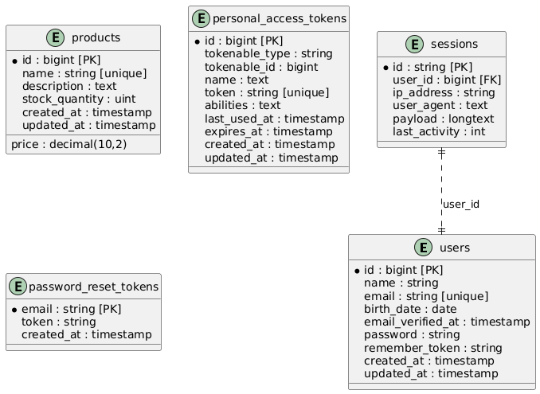

<p align="center"><a href="https://laravel.com" target="_blank"></a></p>

# Test Products - Sistema Fullstack Laravel + Vue + Docker + PostgreSQL


## Descrição do Projeto
Sistema desenvolvido para o teste técnico, focado em gestão de produtos domésticos. Utiliza Laravel 12 no backend, Vue 3 no frontend (SPA), Docker para ambiente isolado e PostgreSQL como banco de dados. A escolha do stack foi motivada pela vaga pleiteada, que valoriza experiência com Vue e PostgreSQL.

O sistema implementa princípios SOLID, garantindo código limpo, modular e fácil manutenção. Possui autenticação protegendo todas as rotas, CRUD completo via web e API RESTful, validações robustas e testes automatizados.


## Como Executar a Aplicação

## Sumário

- [Pré-visualização - Telas](#pré-visualização---telas)
- [Passos para rodar o sistema](#passos-para-rodar-o-sistema)
- [Pré-requisitos](#pré-requisitos)
- [Tecnologias Utilizadas](#tecnologias-utilizadas)
- [Observações Importantes](#observações-importantes)
- [Relatório de Testes](#relatório-de-testes)
- [Como executar os testes](#como-executar-os-testes)
- [Funcionalidades](#funcionalidades)
- [Estrutura do Projeto](#estrutura-do-projeto)
- [Instruções de Instalação e Execução](#instruções-de-instalação-e-execução)
- [Seeders e Banco de Dados](#seeders-e-banco-de-dados)
- [APIs e Rotas](#apis-e-rotas)
- [Customizações e Dicas](#customizações-e-dicas)
- [Problemas Comuns](#problemas-comuns)
- [Decisões de Arquitetura](#decisões-de-arquitetura)
- [Medidas de Segurança](#medidas-de-segurança)
- [Diagrama UML do Banco de Dados](#diagrama-uml-do-banco-de-dados)

## Pré-visualização - Telas
Dashboard:

Módulo de Produtos:

Tela de Login:


## Passos para rodar o sistema
1. Clone o repositório:
	```bash
	git clone https://github.com/henriquesalesmg/Fullstack_products.git
	cd test-products
	```
2. Suba os containers:
	```bash
	docker compose up --build -d
	```
3. Execute as migrações e seeders do banco:
	```bash
	docker compose exec app php artisan migrate --seed
	```
6. Acesse o sistema pelo navegador:
	[http://localhost:8000](http://localhost:8000)

Pronto! O sistema estará disponível para uso, sem necessidade de ajustes manuais.

## Pré-requisitos
- Docker e Docker Compose instalados

## Tecnologias Utilizadas

### Frontend
- **Vue 3**: Framework JavaScript para construção de SPA (Single Page Application)
- **Vite**: Bundler moderno para desenvolvimento e build dos assets
- **Bootstrap 5**: Framework CSS para layout responsivo e componentes visuais
- **PrimeVue**: Componentes UI avançados para Vue
- **TailwindCSS**: Utilitários CSS para estilização rápida

### Backend
- **Laravel 12**: Framework PHP para API e lógica de negócio

### Ambiente
- **Docker**: Containers para ambiente isolado e fácil replicação
- **PostgreSQL**: Banco de dados relacional

### Testes
- **PHPUnit**: Testes unitários e de integração

## Observações Importantes
- O sistema foi projetado para funcionar "out of the box" via Docker, sem configurações manuais.
- Para dúvidas, consulte os comentários no código ou abra uma issue.

## Relatório de Testes

Consulte o relatório de testes automatizados em [TEST_REPORT.md](./TEST_REPORT.md).


## Funcionalidades
- Autenticação protegendo CRUD web e API
- CRUD completo de produtos (nome único, preço positivo, estoque não negativo)
- Listagem com paginação e busca
- API RESTful protegida, respostas padronizadas
- Validações frontend e backend
- Testes automatizados (unitários e de integração)
- Docker para ambiente isolado

## Estrutura do Projeto
```
/
├── app/                 # Código backend Laravel
│   ├── Http/Controllers  # Controllers da API e web
│   ├── Models/           # Modelos Eloquent
│   └── Providers/        # Providers Laravel
├── resources/           # Frontend Vue, CSS, JS, Blade
│   ├── js/               # SPA Vue 3, componentes, páginas
│   ├── css/              # Estilos
│   └── views/            # Templates Blade
├── database/            # Migrations, seeders, factories
├── public/              # Assets públicos, imagens, diagrama UML
├── tests/               # Testes unitários e de integração
├── Dockerfile           # Build do ambiente
├── docker-compose.yml   # Orquestração dos containers
├── .env                 # Configurações de ambiente
└── README.md            # Documentação
```

## Instruções de Instalação e Execução
1. Clone o repositório:
	 ```bash
	 git clone https://github.com/henriquesalesmg/products_fullstack.git
	 cd test-products
	 ```
2. Suba os containers:
	 ```bash
	 docker compose up --build -d
	 ```
3. Execute as migrações e seeders do banco:
	 ```bash
	 docker compose exec app php artisan migrate --seed
	 ```
4. Acesse o sistema pelo navegador:
	 [http://localhost:8000](http://localhost:8000)

## Como executar os testes
Para rodar todos os testes automatizados, utilize o comando abaixo:

```bash
docker compose exec app php artisan test
```

## Seeders e Banco de Dados
- O banco é populado automaticamente ao rodar as migrações/seeders.
- Usuários de exemplo são criados para facilitar testes.
- Estrutura das tabelas: veja o diagrama UML abaixo.

## APIs e Rotas
- API RESTful protegida por autenticação.
- Endpoints principais:
	- `POST /api/login` - Login
	- `POST /api/register` - Cadastro
	- `GET /api/products` - Listagem de produtos
	- `POST /api/products` - Criação de produto
	- `PUT /api/products/{id}` - Atualização
	- `DELETE /api/products/{id}` - Remoção
- Rotas web protegidas por autenticação.
- Todas as rotas aceitam e retornam JSON.

## Customizações e Dicas
- Configuração do banco via `.env`.
- Seeders podem ser editados para adicionar mais dados de exemplo.
- Para desenvolvimento, use `APP_DEBUG=true` no `.env`.
- O frontend pode ser customizado em `resources/js` e `resources/css`.

## Problemas Comuns
- Se o container não subir, verifique se as portas 8000/5432 estão livres.
- Se o banco não popular, rode novamente `php artisan migrate --seed`.
- Permissões: se der erro, rode `chmod -R 777 storage bootstrap/cache` (apenas para desenvolvimento).
- Se assets não carregarem, verifique se o build foi gerado corretamente.

## Decisões de Arquitetura

### Repository e Service
- **Repository:** Abstrai o acesso ao banco de dados, permitindo que controllers e services dependam de uma interface, não diretamente dos models. Facilita testes, manutenção e extensão para novas fontes de dados.
- **Service:** Centraliza regras de negócio e operações complexas, mantendo controllers enxutos e focados apenas em orquestrar requisições. O Service recebe DTOs, valida dados e dispara eventos, seguindo SRP e DIP.

Esses padrões garantem desacoplamento, testabilidade e aderência ao SOLID, tornando o sistema mais robusto e fácil de evoluir.

## Medidas de Segurança
- Autenticação por token (API) e sessão (web).
- Senhas criptografadas.
- Validação de entrada em todas as rotas.
- Rate limiting no login.
- Proteção contra CSRF nas rotas web.
- Proteção contra remoção do próprio usuário logado.

## Diagrama UML do Banco de Dados
O diagrama UML das tabelas principais está disponível abaixo:

O arquivo fonte PlantUML está em `database-erd.puml`.

## Detalhes Técnicos
- **Frontend:** Vue 3 + Vite (SPA)
- **Backend:** Laravel 12
- **Banco de Dados:** PostgreSQL
- **Ambiente:** Docker
- **Testes:** PHPUnit (Feature e Unit)
- **SOLID:** Controllers, Services e Requests seguem princípios SOLID para garantir desacoplamento, responsabilidade única e fácil manutenção.

---

> Sistema desenvolvido para fins de avaliação técnica, destacando experiência com Vue, PostgreSQL, Docker e boas práticas de arquitetura SOLID.
<p align="center">
<a href="https://github.com/laravel/framework/actions"></a>
<a href="https://packagist.org/packages/laravel/framework"></a>
<a href="https://packagist.org/packages/laravel/framework"></a>
<a href="https://packagist.org/packages/laravel/framework"></a>
</p>


